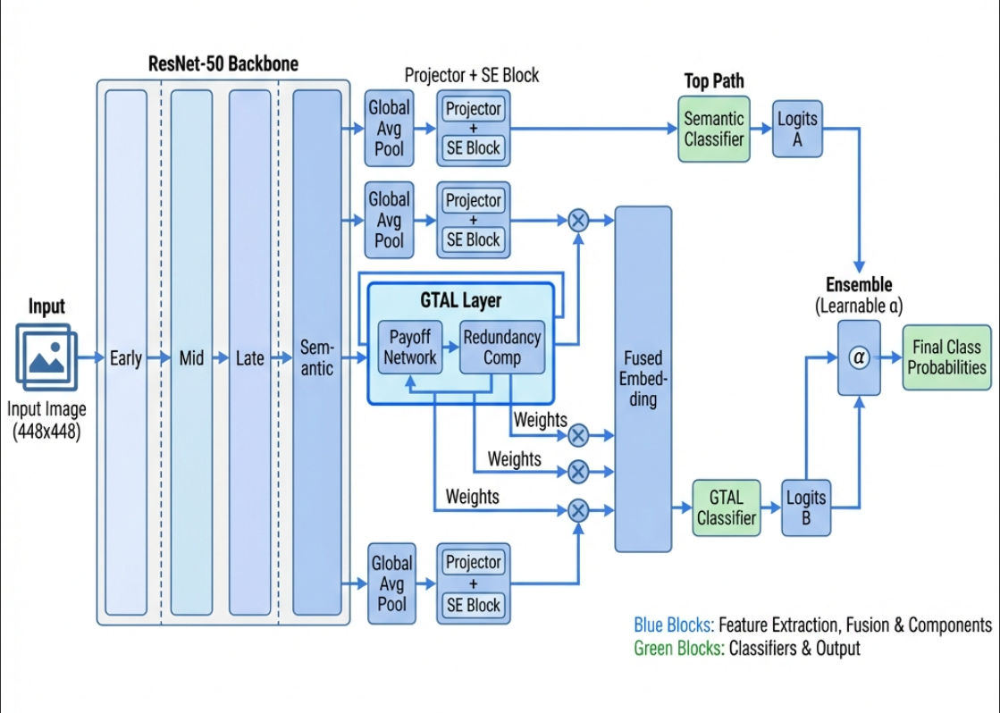

# GTAL+: Game-Theoretic Attention Learning

**GTAL+** (Game-Theoretic Attention Learning Plus) is a novel deep learning framework for fine-grained visual classification (FGVC). It models the feature extraction process as a multi-player cooperative game where different hierarchical feature levels (Early, Mid, Late, Semantic) compete and cooperate to optimize classification performance.



## Overview

Fine-grained classification (e.g., distinguishing bird species) requires capturing both subtle local details and global semantic context. Standard CNNs often prioritize one over the other.

**GTAL+** solves this by treating each feature level of a ResNet-50 backbone as a "player" in a game:
*   **Players**: Feature maps from layers 1, 2, 3, and 4.
*   **Strategy**: Each player learns an attention weight.
*   **Payoff**: Weights are optimized to find a **Nash Equilibrium** that balances individual feature relevance (saliency) against redundancy.

## Key Features

*   **Game-Theoretic Core**: Uses a Nash Equilibrium-based attention mechanism to dynamically weight features.
*   **Multi-Scale Fusion**: Integrates low-level textures and high-level semantics effectively.
*   **V3 Ensemble Architecture**:
    *   **Dual-Path Classification**: Maintains a standard semantic path (like a baseline ResNet) alongside the GTAL fusion path.
    *   **Ensemble Learning**: A learnable parameter $\alpha$ dynamically blends predictions from both paths for maximum accuracy.
    *   **SE Blocks**: Incorporates Squeeze-and-Excitation blocks for channel-wise feature refinement.

## Architecture

The model builds upon a **ResNet-50** backbone. As shown in the architecture diagram above:
1.  Features are extracted from 4 residual blocks.
2.  Each feature map is projected and refined via SE Blocks.
3.  The **GTAL Layer** computes optimal weights based on feature payoff.
4.  Features are fused and classified, while a parallel semantic branch ensures robust baseline performance.
5.  Final predictions are an ensemble of the GTAL and Semantic paths.

## Performance

Tested on the **CUB-200-2011** dataset:
*   **Accuracy**: ~82.84%
*   **Observations**: The model automatically learns to prioritize semantic features (Layer 4) while still leveraging critical details from earlier layers, outperforming standard baselines.

## Getting Started

### Prerequisites
*   Python 3.8+
*   PyTorch
*   Torchvision
*   Pandas, NumPy, Matplotlib

### Usage
Run the training notebook:
```bash
jupyter notebook GTAL_Plus_Colabv2.ipynb
```
The notebook includes the full implementation of the `GTALPlusModelV3`, training loops, and visualization tools.
